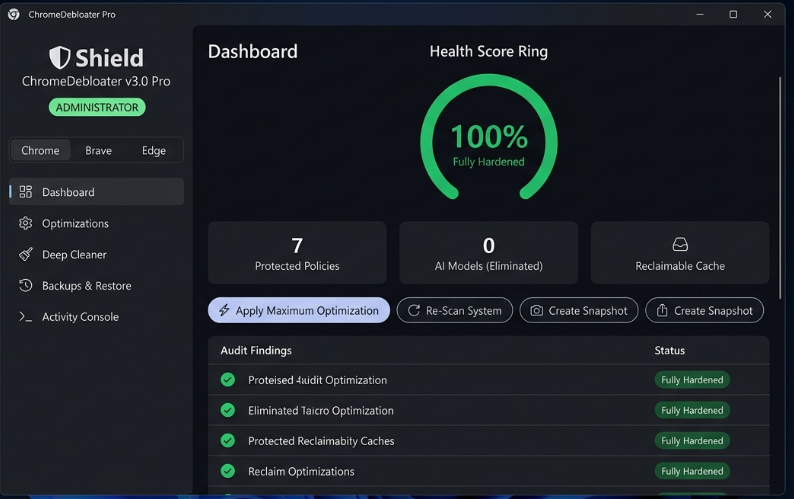

# ChromeDebloater Pro (v3.5)

**Next-generation, ultra-lightweight Windows C++ software to harden, debloat, and optimize Chromium-based browsers without AI.**

Supports: **Google Chrome**, **Brave Browser**, **Microsoft Edge** (All versions & channels)



---

## What Makes ChromeDebloater Pro Different?

- 🎨 **Expanded Modern Dark UI (1260×820)**: High-resolution custom double-buffered GDI+ rendering engine featuring a 270° circular Health Score ring gauge, real-time metric cards, smooth rounded buttons, status pills, and live execution streaming across 7 dedicated navigation pages.
- 🎮 **Chrome Gaming Mode (Low-Latency & High-FPS)**: Specialized mode built for gamers and low-spec systems: kills background instances, unlocks FPS cap (`--disable-frame-rate-limit`), eliminates VSync latency (`--disable-gpu-vsync`), disables background timer throttling (`--disable-background-timer-throttling`), injects zero-copy rasterization, forces 4 raster threads, caps disk cache to 100MB, and creates dedicated Desktop `.lnk` and instant-kill `.bat` launchers.
- 🚫 **Universal Default & Pinned Browser Nag Fix**: Permanently eliminates Chrome's persistent default browser prompts and taskbar pin nagging on new Windows setups across all users via dual HKLM/HKCU policies (`DefaultBrowserSettingEnabled=0`, `HideFirstRunExperience=1`), touching `First Run` sentinels, and patching JSON preferences (`suppress_first_run_default_browser_prompt=true`).
- 🛡🔥 **Kernel-Level Network Shield (Firewall & Hosts)**: Direct outbound blocking of 48 Google, Edge, and Brave telemetry, crashpad crash dumps, and analytics domains via Windows hosts sinkhole (`0.0.0.0`) and 16 Windows Defender Firewall outbound rules.
- 🦁 **Brave Browser Deep Debloat**: Purges Brave Rewards (BAT), Brave Crypto Wallet, Leo AI chat assistant (`BraveAIChatEnabled=0`), Brave VPN (`BraveVPNDisabled=1`), IPFS daemon (`IPFSResolveMethod=0`), P3A telemetry, sponsored New Tab Page background images, and Brave Today news feed.
- 🌀 **Microsoft Edge Deep Debloat**: Disables Edge Copilot / Bing Hubs sidebar (`HubsSidebarEnabled=0`), Edge Shopping / Coupons, Edge Wallet, Math Solver, Citations, Super Resolution, Typosquatting URL telemetry, 24/7 background Startup Boost (`StartupBoostEnabled=0`), and MSN New Tab Page news feed.
- 🔐 **Next-Gen Privacy & Cryptography**: Enforces Encrypted Client Hello (ECH) to prevent SNI leaking, Kyber post-quantum TLS key agreement, URL-Keyed Anonymized Data Collection kill (UKM), Chrome Variations experiment seed restriction, and WebHID/sensor device guards.
- 🌐 **Multi-Browser Upstream Update Checker**: Live upstream release queries directly from official APIs (ChromiumDash, Brave GitHub API, Microsoft Edge) to verify whether your browser is on the latest stable channel or frozen.
- 🧊 **Ultra Low-Resource Mode**: Aggressively clamps process creation (`SitePerProcess=0`, `RendererProcessLimit=4`), clamps disk cache (256MB) and media cache (128MB), enables sleeping tabs (5-min inactive sleep), and injects zero-copy rasterization to cut RAM and CPU overhead drastically on low-spec hardware.
- 🔍 **12-Subsystem Live System Audit Engine**: Automatically inspects browser registry configurations across machine (`HKLM`) and user (`HKCU`) hives, Local State flags, on-disk model caches, and Network Shield status to calculate your **Hardening & Optimization Score (0% – 100%)**.
- 💾 **1-Click Snapshot & Rollback**: Automatically takes a timestamped registry backup before applying changes. Restore to any previous point or reset all policies to factory defaults with one click.
- 🧹 **Deep Profile Cleaner**: Compacts and defragments SQLite databases (`History`, `Favicons`, `Web Data`) via Windows built-in `winsqlite3.dll`, sweeps stale GPU/shader caches, purges on-device AI models and service worker caches, and flushes Windows DNS cache.
- ⚡ **Pure Native Windows Binary**: Only **~400 KB**. Single standalone portable executable. Zero runtime dependencies (no Python, no Node, no Qt, no Electron).
- 🛡 **Native UAC Elevation**: Embedded `requireAdministrator` manifest ensures seamless administrator privilege handling.
- 🖥 **Dual-Mode (GUI + Headless CLI)**: Double-click to launch the graphical dashboard, or run headlessly via terminal / scripts with `--gaming`, `--all`, `--shield`, `--low-resource`, `--shortcuts`, `--check-updates`, `--audit`, or `--clean`.

---

## Included Modules (15 Granular Subsystems)

| Subsystem | Category | Description |
|---|---|---|
| 🤖 **AI, Gemini & Copilot Elimination** | Security | Kills Gemini, PromptAPI, OptimizationGuide, Brave Leo AI (`BraveAIChatEnabled=0`), and Edge Copilot/Hubs across machine and user hives, and purges on-disk foundational models. |
| 🔒 **Quad9 DoH, ECH & Network Guard** | Privacy | Enforces Quad9 DNS-over-HTTPS, Encrypted Client Hello (ECH), HTTPS-Only mode, WebRTC IP leakage mitigation, TLS 1.2 minimum, and blocks WebHID & device sensors. |
| 📡 **Telemetry, UKM & Diagnostics** | Privacy | Suppresses metrics reporting, URL-keyed metrics (UKM), address bar search suggestions, SafeBrowsing extended telemetry, Chrome Variations A/B tests, and component updaters. |
| 🔑 **Authentication Preservation** | Compatibility | Explicitly allowlists authentication cookies to keep Google Sync and Password Manager (Chrome) or Microsoft Account (Edge) functional. |
| ⚡ **Process Clamping & Memory Saver** | Performance | Clamps subframe process inflation (`SitePerProcess=0`), enables maximum tab Memory Saver, enables GPU hardware offload, throttles background JS timers. |
| 🧊 **Ultra Low-Resource Limits** | Performance | Caps renderers to 4, limits disk cache to 256MB, media cache to 128MB, enforces 5-min background tab sleep, disables Edge Startup Boost, and disables speculative prefetching. |
| 🚀 **High-Speed & Security Flags** | Performance | Injects QUIC, zero-copy rasterization, D3D11 ANGLE, Skia Graphite, proactive tab discarding, Kyber post-quantum TLS, and ECH into `Local State`. |
| 🚫 **Privacy Sandbox & Ad Topics** | Privacy | Disables Google Topics API, Privacy Sandbox ad measurement, site-commissioned ads, and user survey prompts. |
| 🛒 **Commercial, Crypto & Shopping Bloat** | Debloat | Disables price tracking, shopping list prompts, Brave Rewards (BAT), Brave Wallet, Brave VPN, IPFS daemon, Edge shopping coupons, Math Solver, and floating search widgets. |
| 🧹 **UI Clutter, News & Background Stripping** | Interface | Strips Cast icon, Desktop Sharing Hub, Google Lens, Edge MSN feed, Brave Today news, Brave sponsored NTP images, and autofill prompts. |
| 🔍 **Private Search Provider** | Privacy | Configures private Brave Search as the default search engine, replacing telemetry-heavy search engines. |
| 🔧 **Profile Defragmentation** | Health | Vacuums and reindexes SQLite databases (`History`, `Favicons`, `Web Data`) via Windows native SQLite, cleans shader/GPU caches, and flushes DNS. |
| 📌 **Permanent 4-Layer Update Lockdown** | Control | Freezes browser version across services, scheduled tasks, and enterprise policies for Chrome, Brave, and Edge. |
| 🛡🔥 **Network Shield (Firewall & Hosts)** | Shield | Adds 16 Windows Defender Firewall outbound rules blocking updaters and crashpad, and sinkholes 48 telemetry domains via Windows hosts file. |
| 🪟 **Zen UI & Quiet Notifications** | Interface | Kills tab hover card thumbnail previews, Google Lens overlay, side search, download bubble animations, and silences site notification permission prompts. |

---

## Quick Start (Portable Binary)

1. Download **`ChromeDebloater.exe`** from the [Releases](https://github.com/KaZuN00B/ChromeDebloater/releases) page or from `dist/ChromeDebloater.exe`.
2. Double-click the executable and accept the Windows UAC Administrator prompt.
3. Use the sidebar to switch between:
   - 📊 **Dashboard**: View your Hardening Score, RAM status, and trigger quick presets.
   - ⚡ **Optimizations**: Choose from **Maximum**, **Balanced**, **Privacy**, or **Ultra-Low Resource** presets, or toggle individual modules.
   - 🛡 **Network Shield**: Manage Windows Firewall rules and hosts file domain sinkholing (48 domains).
   - 🧹 **Deep Cleaner**: Vacuum profile databases and purge GPU/shader caches.
   - 🌐 **Browser Updates**: Verify upstream releases and toggle update freeze per browser.
   - 🔄 **Backups & Restore**: Create restore points or rollback to previous registry states.
   - 📜 **Activity Console**: Monitor live execution events in real time.

---

## Command-Line / Scripting Usage

```cmd
:: Install Chrome Gaming Mode (batch script + desktop shortcut + low-latency flags)
ChromeDebloater.exe --gaming
:: or: ChromeDebloater.exe -g

:: Optimize all existing browser shortcuts (Desktop, Start Menu, Taskbar, Quick Launch)
ChromeDebloater.exe --shortcuts

:: Activate full Windows Network Shield (Firewall + Hosts block)
ChromeDebloater.exe --shield

:: Remove Network Shield rules and restore hosts file
ChromeDebloater.exe --unshield

:: Apply Ultra Low-Resource profile (ideal for low-spec PCs, VMs, or multi-tab usage)
ChromeDebloater.exe --low-resource --browser chrome

:: Apply all 15 optimizations headlessly (auto-creates a safety restore point first)
ChromeDebloater.exe --all --browser chrome

:: Check upstream releases & version status for Chrome, Brave, and Edge
ChromeDebloater.exe --check-updates

:: Freeze or allow browser updates
ChromeDebloater.exe --lock-updates --browser chrome
ChromeDebloater.exe --unlock-updates --browser chrome

:: Run a full 12-subsystem system audit and view your hardening score
ChromeDebloater.exe --audit

:: Deep clean SQLite profile databases, purge caches, and flush DNS
ChromeDebloater.exe --clean

:: Display all command-line options
ChromeDebloater.exe --help
```

---

## Building From Source

Requires: **Visual Studio Build Tools (C++20)**.

```powershell
powershell -ExecutionPolicy Bypass -File .\build.ps1 -Clean
```

Produces a standalone executable at `dist\ChromeDebloater.exe`.

---

## License

MIT License. Free to use, modify, and redistribute.
