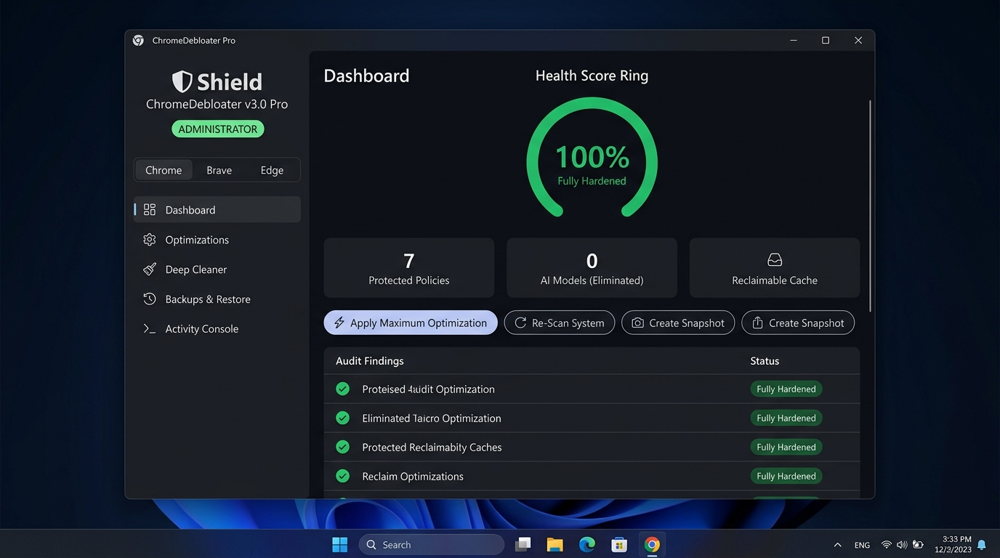

# ChromeDebloater Pro (v3.2)

**Next-generation, ultra-lightweight Windows C++ software to harden, debloat, and optimize Chromium-based browsers without AI.**

Supports: **Google Chrome**, **Brave Browser**, **Microsoft Edge** (All versions & channels)



---

## What Makes ChromeDebloater Pro Different?

- 🎨 **Modern Dark UI**: Custom double-buffered GDI+ rendering engine. No old-school Win32 controls, no Electron, no webview, no Python/Qt bloat. Smooth, responsive desktop experience in deep obsidian `#0B0E14` with glowing status badges and Segoe UI typography.
- 🌐 **Multi-Browser Upstream Update Checker**: Live upstream release queries directly from official APIs (ChromiumDash, Brave GitHub, Microsoft Edge) to verify whether your browser is on the latest stable channel or frozen.
- 🧊 **Ultra Low-Resource Mode**: Aggressively clamps process creation (`SitePerProcess=0`, `RendererProcessLimit=4`), clamps disk cache (256MB) and media cache (128MB), enables sleeping tabs (5-min inactive sleep), and injects zero-copy rasterization to cut RAM and CPU overhead drastically on low-spec hardware.
- 🔍 **Live System Audit Engine**: Automatically inspects browser registry configurations across machine (`HKLM`) and user (`HKCU`) hives and on-disk model caches to calculate your **Hardening & Optimization Score (0% – 100%)**.
- 💾 **1-Click Snapshot & Rollback**: Automatically takes a timestamped registry backup before applying changes. Restore to any previous point or reset all policies to factory defaults with one click.
- 🧹 **Deep Profile Cleaner**: Compacts and defragments SQLite databases (`History`, `Favicons`, `Web Data`) via Windows built-in `winsqlite3.dll`, sweeps stale GPU/shader caches, and flushes Windows DNS cache.
- ⚡ **Pure Native Windows Binary**: Only **~276 KB**. Single standalone portable executable. Zero runtime dependencies.
- 🛡 **Native UAC Elevation**: Embedded `requireAdministrator` manifest ensures seamless administrator privilege handling.
- 🖥 **Dual-Mode (GUI + Headless CLI)**: Double-click to launch the graphical dashboard, or run headlessly via terminal / scripts with `--all`, `--low-resource`, `--check-updates`, `--audit`, or `--clean`.

---

## Included Modules (13 Granular Subsystems)

| Subsystem | Category | Description |
|---|---|---|
| 🤖 **AI & Gemini Elimination** | Security | Kills Gemini, PromptAPI, OptimizationGuide, and Edge Copilot across machine and user hives, and purges on-disk foundational models. |
| 🔒 **Quad9 DoH & Network Guard** | Privacy | Enforces Quad9 DNS-over-HTTPS, HTTPS-Only mode, WebRTC IP leakage mitigation, TLS 1.2 minimum, and blocks device sensors. |
| 📡 **Telemetry & Diagnostics** | Privacy | Suppresses metrics reporting, SafeBrowsing extended telemetry, crashpad diagnostics, Chrome Variations A/B tests, and Edge DiagnosticData. |
| 🔑 **Authentication Preservation** | Compatibility | Explicitly allowlists authentication cookies to keep Google Sync and Password Manager (Chrome) or Microsoft Account (Edge) functional. |
| ⚡ **Process Clamping & Memory Saver** | Performance | Clamps subframe process inflation (`SitePerProcess=0`), enables maximum tab Memory Saver, enables GPU hardware offload, throttles background JS timers. |
| 🧊 **Ultra Low-Resource Limits** | Performance | Caps renderers to 4, limits disk cache to 256MB, media cache to 128MB, enforces 5-min background tab sleep, and disables speculative prefetching. |
| 🚀 **High-Speed Performance Flags** | Performance | Injects QUIC, zero-copy rasterization, D3D11 ANGLE, Skia Graphite, proactive tab discarding, and parallel downloading into `Local State`. |
| 🚫 **Privacy Sandbox & Ad Topics** | Privacy | Disables Google Topics API, Privacy Sandbox ad measurement, site-commissioned ads, and user survey prompts. |
| 🛒 **Commercial & Shopping Bloat** | Debloat | Disables price tracking, shopping list prompts, Edge shopping discounts/coupons, Math Solver, and floating desktop search widgets. |
| 🧹 **UI Clutter & Background Stripping** | Interface | Strips Cast icon from toolbar, Desktop Sharing Hub, shared clipboard, Google Lens search, and new tab page news feeds. |
| 🔍 **Private Search Provider** | Privacy | Configures private Brave Search as the default search engine, replacing telemetry-heavy search engines. |
| 🔧 **Profile Defragmentation** | Health | Vacuums and reindexes SQLite databases (`History`, `Favicons`, `Web Data`) via Windows native SQLite, cleans shader/GPU caches, and flushes DNS. |
| 📌 **Permanent 4-Layer Update Lockdown** | Control | Freezes browser version across services, scheduled tasks, and enterprise policies for Chrome, Brave, and Edge. |

---

## Quick Start (Portable Binary)

1. Download **`ChromeDebloater.exe`** from the [Releases](https://github.com/KaZuN00B/ChromeDebloater/releases) page or from `dist/ChromeDebloater.exe`.
2. Double-click the executable and accept the Windows UAC Administrator prompt.
3. Use the sidebar to switch between:
   - 📊 **Dashboard**: View your Hardening Score, RAM status, and trigger quick presets.
   - ⚡ **Optimizations**: Choose from **Maximum**, **Balanced**, **Privacy**, or **Ultra-Low Resource** presets, or toggle individual modules.
   - 🧹 **Deep Cleaner**: Vacuum profile databases and purge GPU/shader caches.
   - 🌐 **Browser Updates**: Verify upstream releases and toggle update freeze per browser.
   - 🔄 **Backups & Restore**: Create restore points or rollback to previous registry states.
   - 📜 **Activity Console**: Monitor live execution events in real time.

---

## Command-Line / Scripting Usage

```cmd
:: Check upstream releases & version status for Chrome, Brave, and Edge
ChromeDebloater.exe --check-updates

:: Run a full system audit and view your hardening score
ChromeDebloater.exe --audit

:: Apply Ultra Low-Resource profile (ideal for low-spec PCs, VMs, or multi-tab usage)
ChromeDebloater.exe --low-resource --browser chrome

:: Apply all 13 optimizations headlessly (auto-creates a safety restore point first)
ChromeDebloater.exe --all --browser chrome

:: Freeze or allow browser updates
ChromeDebloater.exe --lock-updates --browser chrome
ChromeDebloater.exe --unlock-updates --browser chrome

:: Deep clean SQLite profile databases, purge caches, and flush DNS
ChromeDebloater.exe --clean

:: Display all command-line options
ChromeDebloater.exe --help
```

---

## Building From Source

Requires: **Visual Studio Build Tools (C++20)**.

```powershell
powershell -ExecutionPolicy Bypass -File .\build.ps1 -Clean
```

Produces a standalone executable at `dist\ChromeDebloater.exe`.

---

## License

MIT License. Free to use, modify, and redistribute.
